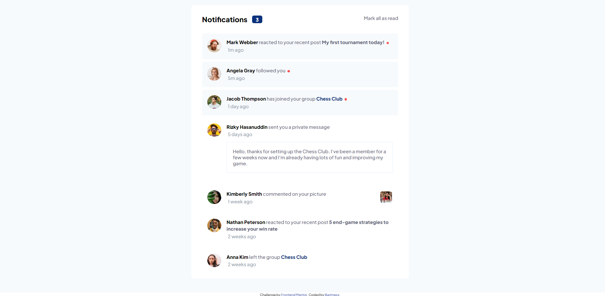
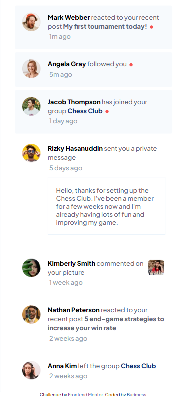

# notifications-page-main
 this is a mockup of a notification system built as a solution to the [Notifications page challenge on Frontend Mentor](https://www.frontendmentor.io/challenges/notifications-page-DqK5QAmKbC). for practicing purposes and improvement.

## Table of contents

- [Overview](#overview)
  - [The challenge](#the-challenge)
  - [Screenshot](#screenshot)
  - [Links](#links)
- [My process](#my-process)
  - [Built with](#built-with)
  - [What I learned](#what-i-learned)
  - [Continued development](#continued-development)
  - [Useful resources](#useful-resources)
- [Author](#author)

## Overview

### The challenge

Users should be able to:

- Distinguish between "unread" and "read" notifications
- Select "Mark all as read" to toggle the visual state of the unread notifications and set the number of unread messages to zero
- View the optimal layout for the interface depending on their device's screen size
- See hover and focus states for all interactive elements on the page

### Screenshot

#### Desktop View


#### Mobile View


### Links

- Live Site URL: [Add live site URL here](https://barimess.github.io/notifications-page-main)

## My process

### Built with

- Semantic HTML5 markup
- CSS custom properties
- Flexbox
- CSS Grid
- Mobile-first workflow

### What I learned

if you want to display an empty span in html you have to either include padding or change it's properties as follows

```html
<span class="span"></span>
```
```css
.span {
  background-color: red;
  display:inline-block
  /* padding: 00px */
}
```
the `display: inline-block` insures it behaves like a block but on an inline level so it's width is taken into consideration unlike `inline` which ignores width. 

### Continued development

the sizing proved to be difficult even with the use of [pixelspy](https://pixspy.com/), which provided close to perfect pixel sizing but the end result ended up being a bit bigger in scale than the provided design. but in a sense it's still a one to one replica just different scales so excuse that.


### Useful resources

- [pixelspy](https://pixspy.com/) - would recommend this to get an accurate counting for the pixels spacing even on a given image if you don't have the exact design specs or figma files.


## Author

- Frontend Mentor - [@barimess](https://www.frontendmentor.io/profile/barimess)
- Twitter - [@barimess1](https://www.twitter.com/barimess1)
